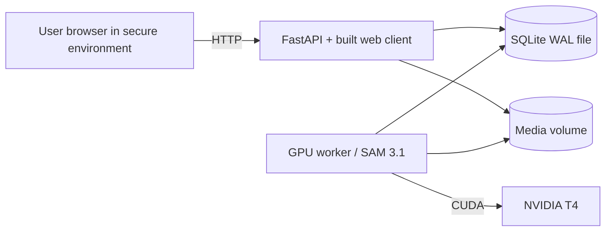
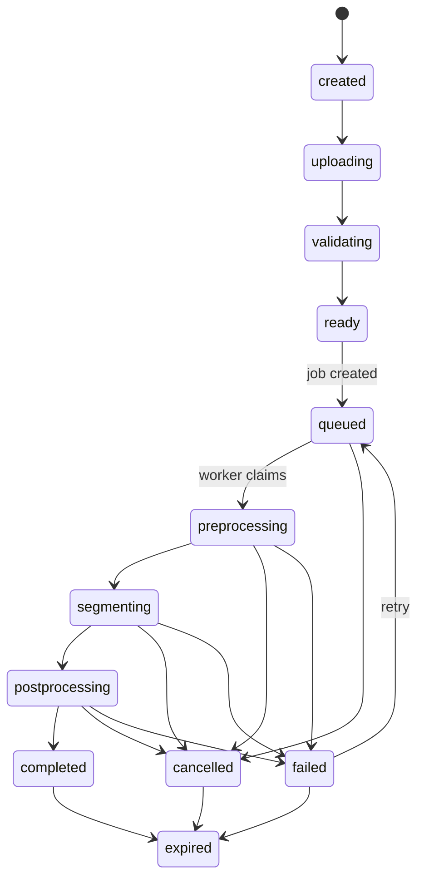

# Technical Design: SAM 3 Paddle Video Segmentation

**Status:** Draft for alignment  
**Version:** 0.1  
**Date:** 2026-07-05  
**Related:** [PRD](./PRD.md)

## 1. Executive decision

Build a single-host system with three runtime processes:

1. a Python FastAPI service that also serves the built React/TypeScript client;
2. one Python GPU worker with SAM 3.1 loaded persistently;
3. a scheduled cleanup/reconciliation process.

SQLite stores metadata and the durable job queue. Uploaded media and mask results live on the server's attached filesystem behind a small storage interface. FastAPI serves APIs, the built web client, and authorized byte-range video/result responses.

This shape deliberately avoids containers, Nginx, PostgreSQL, Redis, and object storage in the first release. It is appropriate for one T4 host and low request concurrency. Moving to multiple API replicas, multiple hosts, or multiple GPU workers is the trigger to replace SQLite and reconsider shared/object storage.

### 1.1 Constraints accepted for MVP

- The SQLite database must be on the host's local disk, not NFS or another network filesystem.
- Run exactly one API process and one queue-claiming GPU worker. Async request handling is allowed, but multiple Uvicorn worker processes are not.
- The database file, WAL file, media, temporary files, and results must be on durable storage with sufficient free-space monitoring.
- Atomic file publication requires temporary and final paths to be on the same filesystem.
- Back up SQLite with its online backup API or `VACUUM INTO`, not by copying a live database file. Raw videos and derived masks are disposable under the retention policy and do not require backup.
- FastAPI can serve the expected low-volume video traffic with byte-range responses. A dedicated proxy/CDN becomes necessary if concurrent viewers or internet traffic grow materially.
- Plain HTTP and no application authentication are accepted only because the secure environment is the MVP trust boundary.
- Native installation increases host dependency sensitivity. The deployment must pin Python packages, the SAM commit/checkpoint, PyTorch/CUDA, and FFmpeg, and include a repeatable install script.

## 2. Important technical decisions

| Area | Decision | Reason |
|---|---|---|
| Model | Pin a tested SAM 3.1 commit and checkpoint | Reproducibility; checkpoint and code must remain compatible |
| API | FastAPI + Pydantic + generated OpenAPI | Same Python environment as inference, typed contracts, simple async API |
| Web | React + TypeScript + Vite | Good video/canvas support with a small build surface |
| Database | SQLite in WAL mode | Durable local metadata with no separate service |
| Queue | SQLite table with an atomic claim transaction | Sufficient for one API process and one GPU worker |
| Media | Local attached filesystem through a `Storage` interface | Lowest operational complexity for a single host |
| Upload | Chunked, resumable API upload | Remote 500 MB uploads should survive connection interruption |
| Worker | One process, one active GPU job | Prevent T4 memory contention and unpredictable latency |
| Precision | FP16 autocast after quality validation | T4 supports FP16 well; do not assume BF16 support |
| Prompts | One SAM video session/pass per text prompt in MVP | Avoid assuming efficient multi-concept prompting in one session |
| Results | Time-chunked COCO-style RLE masks plus manifest | Compact, seekable, and renderable without baking a new video |
| Playback sync | Video presentation timestamps, not only frame numbers | Handles normalized media and browser seeking reliably |
| Progress | Polling first; optional Server-Sent Events later | Robust and sufficient at low scale |
| Deployment | Python virtual environments + `systemd` units | Small native deployment with automatic restart and logs |

## 3. Context and boundaries



The browser never talks directly to the model process, database, or filesystem. The API owns resource state and validates file access. The secure environment controls who can reach the API. The GPU worker owns model initialization and inference.

## 4. Repository layout

Proposed monorepo:

```text
/
├── apps/
│   └── web/                    # React/TypeScript client
├── services/
│   └── api/                    # FastAPI app and HTTP contracts
├── packages/
│   ├── domain/                 # Shared Python domain models
│   ├── storage/                # Local filesystem implementation
│   └── sam_worker/             # SAM adapter and job processor
├── migrations/                 # Database migrations
├── deploy/
│   ├── systemd/
│   ├── install.sh
│   └── env.example
├── tests/
│   ├── fixtures/
│   ├── integration/
│   └── e2e/
├── PRD.md
└── TECHNICAL_DESIGN.md
```

The upstream SAM 3 repository should be installed at a pinned commit in the worker environment, not copied and modified throughout this repository. Project-specific integration belongs in a narrow adapter.

## 5. Runtime architecture

### 5.1 Web client

Responsibilities:

- validate basic file properties before upload;
- upload chunks with retry and progress;
- create jobs and poll status;
- play normalized browser-compatible video;
- fetch result chunks near the current playback time;
- decode RLE masks in a Web Worker;
- render overlays on a canvas aligned with the video;
- expose prompt, instance, box, label, and opacity controls.

Recommended browser APIs:

- `requestVideoFrameCallback` to obtain the displayed frame media time;
- `ResizeObserver` to keep canvas and video geometry aligned;
- Web Worker for RLE decoding;
- IndexedDB only as an optional short-lived chunk cache.

### 5.2 API service

Responsibilities:

- create and complete uploads;
- validate media metadata;
- create, list, cancel, retry, delete, and expire jobs;
- return manifests and mask chunks;
- expose health and readiness;
- reconcile upload and job state after restarts.

The API does not import or initialize the SAM model.

### 5.3 GPU worker

The worker starts once, validates CUDA and the checkpoint, loads the model, then loops:

1. claim the oldest eligible queued job in a database transaction;
2. mark it `preprocessing`;
3. normalize/probe the video if needed;
4. process each text prompt sequentially;
5. compact and write result chunks atomically;
6. create the result manifest;
7. mark the job `completed`;
8. release per-job CPU/GPU state and clear recoverable caches.

Only one job is active per T4. A future worker may claim jobs by a `required_gpu_class` field without changing the API.

### 5.4 SQLite queue

SQLite configuration:

```sql
PRAGMA journal_mode = WAL;
PRAGMA foreign_keys = ON;
PRAGMA busy_timeout = 5000;
PRAGMA synchronous = NORMAL;
```

Every process opens its own database connection. Transactions remain short and no transaction stays open during video or model processing.

The single worker claims work atomically:

```sql
BEGIN IMMEDIATE;

UPDATE jobs
SET state = 'preprocessing',
    worker_id = :worker_id,
    worker_heartbeat_at = :now,
    started_at = COALESCE(started_at, :now)
WHERE id = (
    SELECT id
    FROM jobs
    WHERE state = 'queued'
      AND cancel_requested_at IS NULL
    ORDER BY priority DESC, created_at ASC
    LIMIT 1
)
RETURNING *;

COMMIT;
```

`BEGIN IMMEDIATE` serializes the brief claim against concurrent API writes. The API retries transient `SQLITE_BUSY` failures with bounded jitter. The architecture must retain one API process and one claiming worker; several Uvicorn workers or GPU workers are not supported with SQLite.

A periodic reconciler marks a running job retryable when its worker heartbeat is stale. The database stores state, not video blobs or masks.

## 6. Upload and media normalization

### 6.1 Chunked upload protocol

1. `POST /api/v1/videos` creates a video and upload session.
2. The API returns `video_id`, `upload_id`, chunk size, and expiry.
3. The browser sends ordered or parallel `PUT` requests to `/videos/{video_id}/parts/{part_number}` with byte range and checksum.
4. `POST /videos/{video_id}/complete` verifies all ranges and the whole-file checksum.
5. The API probes the file with `ffprobe` and records authoritative metadata.

Each part is idempotent. Completion uses a temporary file and atomic rename so partially assembled media never appears valid.

### 6.2 Normalization

Create a normalized review/inference asset when the source is not already suitable:

- container: MP4;
- video: H.264 for broad browser compatibility;
- pixel format: `yuv420p`;
- no variable frame rate in the normalized asset;
- maximum normalized frame rate: 30 fps;
- working resolution: preserve aspect ratio within the configured limit;
- audio: copied when compatible or encoded to AAC; ignored by inference;
- retain a mapping between normalized frame index and presentation timestamp.

The normalized asset is the timing authority for both inference and browser review. The original remains available only until retention cleanup.

Rotation metadata must be applied during normalization so mask dimensions match displayed pixels.

## 7. SAM 3.1 integration

### 7.1 Adapter boundary

Expose a small internal interface:

```python
class VideoSegmenter(Protocol):
    def segment(
        self,
        video_path: Path,
        prompt: str,
        progress: Callable[[FrameProgress], None],
        cancelled: Callable[[], bool],
    ) -> Iterable[FrameResult]: ...
```

The adapter translates upstream session requests and outputs into project-owned domain objects. Upstream response dictionaries must not leak into API contracts.

Checkpoint loading supports two modes:

- default: omit `SAM3_CHECKPOINT_PATH` and allow the upstream builder to download the gated SAM 3.1 checkpoint from Hugging Face;
- offline: set `SAM3_CHECKPOINT_PATH` to `sam3.1_multiplex.pt` and `SAM3_OFFLINE=1`; the worker verifies the file before model import and disables Hugging Face network access.

### 7.2 Prompt execution

For MVP, prompts are processed sequentially:

```text
prompt 1 → start SAM session → add text prompt → collect masks → close session
prompt 2 → start SAM session → add text prompt → collect masks → close session
...
```

SAM 3.1 Object Multiplex may track multiple matching instances for a concept efficiently, but it does not remove the need to validate multi-concept behavior. Sequential prompt passes are predictable and allow per-prompt failures and metrics. A later optimization may share video features if the upstream API provides a supported path.

Initial configurable limits:

- 1–3 prompts per job;
- 80 characters per prompt;
- one active job;
- a capped number of retained instances per prompt based on score and benchmark results.

### 7.3 T4 constraints

- Use FP16 autocast only after comparing it with FP32 on the validation set.
- Do not enable BF16 on the T4.
- Do not assume optional FlashAttention packages support the T4 architecture.
- Start without `torch.compile`; benchmark compile time, memory, and steady-state benefit before enabling it.
- Decode frames incrementally and avoid retaining uncompressed masks for the entire video.
- Flush completed mask chunks to CPU storage as processing advances.
- Record peak allocated and reserved CUDA memory for every job.
- On CUDA OOM, terminate the current model session, free its state, mark the job with `GPU_OUT_OF_MEMORY`, and keep the worker healthy if recovery succeeds.

The Phase 0 benchmark determines final resolution, duration, prompt, and object-count limits. If representative 720p videos do not fit reliably, the fallback is lower inference resolution or shorter processing segments—not concurrent jobs.

### 7.4 Cancellation

Cancellation is cooperative:

- the API sets `cancel_requested_at`;
- the worker checks between frames or upstream propagation steps;
- partial result files remain in a temporary job directory;
- cancellation closes the model session, deletes temporary results, and sets `cancelled`.

Cancellation latency depends on where the upstream predictor yields control and must be measured.

## 8. Result format and playback

### 8.1 Manifest

`GET /api/v1/jobs/{job_id}/results` returns a manifest:

```json
{
  "schema_version": 1,
  "job_id": "01...",
  "video": {
    "url": "/api/v1/videos/01.../content",
    "width": 1280,
    "height": 720,
    "fps": 30,
    "duration_ms": 42120,
    "frame_count": 1264
  },
  "prompts": [
    {"id": "p1", "text": "paddle shaft", "color": "#35C2FF"}
  ],
  "instances": [
    {"id": "p1:4", "prompt_id": "p1", "color": "#35C2FF"}
  ],
  "chunks": [
    {
      "start_ms": 0,
      "end_ms": 2000,
      "url": "/api/v1/jobs/01.../results/chunks/000000"
    }
  ]
}
```

### 8.2 Mask chunks

Default chunk duration: 2 seconds, configurable after measuring size and seek latency.

Each chunk contains:

- frame index;
- exact presentation timestamp in milliseconds;
- prompt ID;
- instance ID;
- bounding box;
- score if available;
- binary mask encoded as COCO-style RLE in normalized-video dimensions.

Use a versioned compact binary envelope such as MessagePack with gzip or Brotli transport compression. JSON can be supported in development for inspection, but is not the default for large results.

Files are written to a temporary path, checksummed, atomically renamed, and only then referenced by the manifest.

### 8.3 Rendering synchronization

For every displayed video frame:

1. `requestVideoFrameCallback` supplies `mediaTime`;
2. the client selects the closest result timestamp within half a frame interval;
3. a Web Worker decodes visible masks;
4. the canvas is cleared and redrawn using the video's displayed content rectangle;
5. masks are scaled from normalized pixel coordinates to that rectangle.

The player must account for letterboxing and device pixel ratio. If no result timestamp is within tolerance, it draws no mask and records a development diagnostic rather than showing a stale mask.

## 9. Domain model

### 9.1 Core tables

#### `videos`

- `id` UUID/ULID primary key
- `original_filename`
- `state`
- `source_storage_key`
- `normalized_storage_key`
- `mime_type`
- `size_bytes`
- `sha256`
- `width`, `height`
- `fps_num`, `fps_den`
- `duration_ms`
- `frame_count`
- `codec`
- `error_code`, `error_detail`
- `created_at`, `validated_at`, `expires_at`, `deleted_at`

#### `upload_parts`

- `upload_id`
- `video_id`
- `part_number`
- `byte_start`, `byte_end`
- `size_bytes`
- `sha256`
- `storage_key`
- `created_at`

Unique constraint: `(upload_id, part_number)`.

#### `jobs`

- `id`
- `video_id`
- `state`
- `priority`
- `progress_stage`
- `processed_frames`, `total_frames`
- `settings_json` TEXT containing validated JSON
- `model_name`, `model_commit`, `checkpoint_id`
- `worker_id`, `worker_heartbeat_at`
- `attempt`
- `cancel_requested_at`
- `error_code`, `error_detail`
- `created_at`, `started_at`, `completed_at`, `expires_at`, `deleted_at`

#### `job_prompts`

- `id`
- `job_id`
- `position`
- `text`
- `color`
- `state`
- `error_code`

#### `result_chunks`

- `id`
- `job_id`
- `sequence`
- `start_ms`, `end_ms`
- `storage_key`
- `size_bytes`
- `sha256`
- `created_at`

### 9.2 State transitions



Video upload/validation state and segmentation job state should be separate in storage even if the UI presents one combined timeline.

## 10. API contract details

### 10.1 Create video

`POST /api/v1/videos`

Request:

```json
{
  "filename": "session.mov",
  "size_bytes": 183442120,
  "mime_type": "video/quicktime",
  "sha256": "optional-whole-file-checksum"
}
```

Response: `201 Created`

```json
{
  "video_id": "01...",
  "upload_id": "01...",
  "chunk_size_bytes": 8388608,
  "expires_at": "2026-07-05T12:00:00Z"
}
```

### 10.2 Create job

`POST /api/v1/jobs`

Headers: `Idempotency-Key: <client-generated value>`

Request:

```json
{
  "video_id": "01...",
  "prompts": [
    {"text": "paddle shaft"}
  ],
  "settings": {
    "working_max_dimension": 1280,
    "include_boxes": true,
    "score_threshold": 0.5
  }
}
```

Response: `202 Accepted`

```json
{
  "job_id": "01...",
  "state": "queued",
  "status_url": "/api/v1/jobs/01..."
}
```

Only allowlisted settings are accepted. Server policy can lower limits regardless of the submitted values.

### 10.3 Status

`GET /api/v1/jobs/{job_id}`

```json
{
  "job_id": "01...",
  "state": "segmenting",
  "progress": {
    "stage": "segmenting",
    "prompt_index": 1,
    "prompt_count": 1,
    "processed_frames": 642,
    "total_frames": 1264,
    "percent": 50.8
  },
  "error": null,
  "created_at": "2026-07-05T10:00:00Z",
  "started_at": "2026-07-05T10:00:08Z"
}
```

Progress is monotonic within an attempt but is explicitly approximate.

### 10.4 Error model

```json
{
  "error": {
    "code": "GPU_OUT_OF_MEMORY",
    "message": "The video could not be processed with the selected settings.",
    "retryable": true,
    "request_id": "01..."
  }
}
```

Initial error codes:

- `INVALID_VIDEO`
- `UNSUPPORTED_CODEC`
- `UPLOAD_INCOMPLETE`
- `CHECKSUM_MISMATCH`
- `VIDEO_LIMIT_EXCEEDED`
- `INVALID_PROMPT`
- `MODEL_UNAVAILABLE`
- `GPU_OUT_OF_MEMORY`
- `INFERENCE_FAILED`
- `STORAGE_UNAVAILABLE`
- `JOB_CANCELLED`
- `RESOURCE_EXPIRED`
- `NOT_FOUND`
- `FORBIDDEN`

Internal stack traces never appear in API responses.

## 11. Storage layout

```text
/data/
├── uploads/{video_id}/
│   ├── parts/
│   └── source
├── videos/{video_id}/
│   ├── normalized.mp4
│   └── frame_timestamps.msgpack
├── jobs/{job_id}/
│   ├── manifest.json
│   └── chunks/000000.msgpack
└── tmp/
```

All storage keys are generated identifiers; user filenames are metadata only. FastAPI returns byte-range-capable file responses only for known database resources. Paths must not be constructed from user input, and resolved paths must remain under the configured data root.

## 12. Security boundary

For the MVP, network access to the secure environment is the authorization boundary. FastAPI does not implement login, sessions, API keys, or TLS.

Retain these low-cost protections:

- bind only to the private interface selected in deployment configuration;
- serve the client and API from the same origin by default;
- keep CORS disabled unless a separate browser application must call the API, then allow only explicit origins through `SAM3_CORS_ALLOW_ORIGINS`;
- cap request body, chunk, prompt, and result-query sizes;
- run the API and worker as separate unprivileged operating-system users;
- expose CUDA/model credentials only to the worker process;
- load secrets from permission-restricted environment files;
- run FFmpeg with time and resource limits;
- avoid returning raw storage paths;
- reject path traversal and verify every resolved path remains under the data root.

Before the service is reachable from an untrusted network, add TLS, authentication, owner-scoped authorization, and rate limiting. This is an explicit post-MVP security gate.

## 13. Deployment

### 13.1 Host prerequisites

- NVIDIA T4 with 16 GB VRAM;
- NVIDIA driver compatible with the selected CUDA/PyTorch build;
- CUDA runtime/tooling required by the pinned PyTorch build;
- sufficient local SSD capacity for concurrent upload, normalized video, and results;
- Python 3.12 and a reproducible package manager/lockfile;
- SQLite version 3.35+ for `RETURNING`;
- a private address reachable only inside the secure environment.

### 13.2 Processes

```text
sam3-api.service       # one Uvicorn process; API + built web assets
sam3-worker.service    # one process; owns the T4 and model
sam3-cleanup.timer     # periodic expiry and reconciliation
```

Use separate Python virtual environments for the lightweight API and the CUDA-heavy worker if dependency isolation materially reduces deployment risk. Shared project packages are installed from the same pinned source revision. The worker environment pins:

- Python version;
- PyTorch/CUDA build;
- SAM repository commit;
- checkpoint identifier and checksum;
- FFmpeg version;
- project package lock.

Build the React application during release packaging and place immutable assets under the API's static directory. FastAPI registers `/api/v1` routes before a final SPA fallback route.

Do not download model weights during every process start. Provision them into a protected persistent model cache and verify their checksum/readability during worker readiness.

Run plain HTTP on a configured private address, for example `uvicorn ... --host 10.x.x.x --port 8000`. Do not bind to a public interface. TLS termination and application authentication are intentionally deferred.

### 13.3 Health

- `/health/live`: API event loop is responsive.
- `/health/ready`: the SQLite file and required storage are readable/writable.
- worker heartbeat: process is alive, CUDA is available, model is loaded, and no unrecoverable GPU error exists.
- system readiness shown to the UI combines API readiness and a recent healthy worker heartbeat.

## 14. Observability

Structured logs include `request_id`, `video_id`, `job_id`, `attempt`, `worker_id`, and stage where applicable.

Metrics:

- upload bytes and failures;
- queue depth and queue wait;
- per-stage duration;
- frames processed per second;
- real-time factor (`processing_seconds / video_seconds`);
- prompt and instance counts;
- peak GPU allocated/reserved memory;
- GPU utilization and temperature from host monitoring;
- result bytes per video minute;
- cancellation latency;
- failures by error code;
- stale/recovered jobs;
- cleanup deletions and failures.

Never use prompt text, filenames, tokens, or signed URLs as metric labels.

## 15. Recovery and retention

- API restart: uploads and queued/running state remain in the SQLite file.
- Worker restart: heartbeat becomes stale; the reconciler marks the attempt failed and retryable.
- Host restart: `systemd` restarts processes; jobs are reconciled after storage readiness.
- Database unavailable: no new job is claimed; current work stops before publishing a manifest.
- Disk full: fail before inference when estimated free space is insufficient; cleanup expired content.
- Corrupt result chunk: checksum failure makes the job unavailable and retryable.

Cleanup is two-phase:

1. mark the resource expired/deleted in the database;
2. remove files idempotently, then retain a tombstone/audit record for a configurable period.

## 16. Testing strategy

### Unit tests

- state transition rules;
- upload range and checksum validation;
- prompt and setting validation;
- mask encoding/decoding;
- timestamp-to-frame selection;
- geometry for rotation, scaling, and letterboxing;
- storage path safety;
- retry and stale-worker reconciliation.

### Integration tests

- SQLite atomic queue claiming, busy retry, and no double claim;
- chunk upload, restart, completion, and cleanup;
- FFmpeg normalization for MP4/MOV, variable frame rate, and rotation;
- result manifest/chunk round trip;
- cancellation and worker restart;
- path safety and same-origin static/API routing.

### Model tests

- a tiny checked-in or provisioned video smoke fixture;
- paddle validation set with representative blur, occlusion, multiple paddles, and scene cuts;
- FP16 versus FP32 quality comparison;
- memory and speed matrix by resolution, duration, prompt count, and instance count;
- model/checkpoint compatibility test at image build or deployment qualification time.

GPU/model tests run on the target class of host, not in ordinary CPU CI.

### End-to-end tests

- upload → process → review;
- pause, seek, frame-step, and overlay synchronization;
- retry after a controlled failure;
- cancel and delete;
- expired resource behavior;
- browser coverage for current Chrome and one additional Chromium/Firefox target.

## 17. Benchmark gate

Before committing final production limits, run at least:

| Variable | Values |
|---|---|
| Resolution | 480p, 720p, 1080p |
| Duration | 10 s, 60 s, 300 s |
| Frame rate | 24, 30, 60 normalized to policy |
| Prompts | paddle, paddle shaft, paddle blade |
| Visible instances | 1, 2, crowded |
| Precision | FP32, FP16 |
| Conditions | clear, blur, partial occlusion, full occlusion, scene cut |

Record real-time factor, peak VRAM, failures, output size, visible-frame recall, and a small manually annotated mask-quality sample. Final server limits must include safety margin rather than use the largest single successful run.

## 18. Delivery sequence

1. **Environment spike:** validate driver/CUDA/PyTorch/checkpoint and one upstream SAM 3.1 video on the T4.
2. **Model adapter:** produce versioned mask chunks from a local video and prompt.
3. **Media pipeline:** upload, validation, normalization, storage, and cleanup.
4. **Durable jobs:** database schema, claiming, heartbeat, retry, cancellation, and status.
5. **Review prototype:** synchronized video/canvas rendering from fixture chunks.
6. **Vertical slice:** browser upload through completed remote inference and review.
7. **Hardening:** auth, limits, failure recovery, metrics, benchmark, and deployment runbook.

## 19. Alternatives considered

### PostgreSQL or Redis plus Celery/RQ

Reasonable when there are several API replicas or workers, but they add operational dependencies without improving the single-worker MVP enough. SQLite is sufficient while all processes share one host and the documented concurrency limits are preserved.

### Store rendered annotated MP4 only

Easy to play but loses interactive toggles, confidence/ID inspection, and efficient prompt comparison. It also adds another full video encode. It remains a future export option.

### Send PNG masks per frame

Simple but creates many files and excessive storage/request overhead. Time-chunked RLE is better suited to sparse binary masks.

### Store all masks in one JSON response

Easy initially but causes slow startup, high memory usage, and poor random seeking on longer videos.

### Kubernetes

Useful for multiple nodes and GPUs, but unjustified for one T4 host. Process and package boundaries keep later migration possible.

## 20. Alignment items

The recommended defaults are:

1. FastAPI serving the React/TypeScript build, SQLite in WAL mode, local attached storage, and native `systemd` services.
2. One active GPU job and sequential text prompts.
3. Normalized MP4 as the timing authority.
4. Interactive client-side RLE overlays rather than a pre-rendered output video.
5. Polling every 1–2 seconds for job state in MVP.
6. The secure network is the trust boundary; no application authentication or TLS in MVP.
7. No manual mask correction or exports until after the vertical slice.

Decisions still requiring confirmation:

- Should a job accept one prompt only for the first vertical slice, then add multiple prompts?
- Is an annotated MP4 export required despite the PRD placing it after MVP?
- Which browsers must be supported?

Confirmed MVP constraints:

- SQLite replaces PostgreSQL.
- FastAPI serves the built client and protected files; Nginx is not required.
- Native processes replace Docker Compose.
- Local filesystem storage replaces object storage.
- Plain HTTP is allowed inside the secure environment; TLS and application authentication are deferred.
